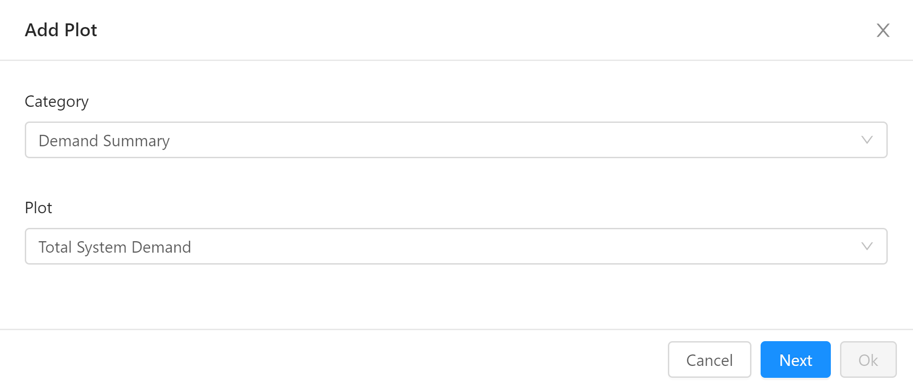

The CityEnergyAnalyst consists of a core set of tools and visualizations of the output of those tools. This article is about extending that set with your own tools and your own visualizations. To do that, you'll need to write a CEA plugin.

## Anatomy of a CEA plugin

A CEA plugin is made up of the following elements:

- a description of tools and the parameters they accept (`scripts.yml`)

- a definition of those parameters - default values, descriptions, types etc. (`plugin.config`)

- a definition of the input and output files defined by the plugin (`schemas.yml`)

- a description of the plots (`plots.yml`)

## A Walkthrough of the CEA plugin template

We've set up a [repository with a sample CEA plugin on GitHub](https://github.com/architecture-building-systems/cea-plugin-template). It implements a script called `demand-summary` as well as a plot called "Total System Demand". Both are located under "Demand Summary". Let's take a look at the files in the template:

```
cea-plugin-template
│   .gitignore
│   LICENSE
│   README.md
│   setup.py
│
\---cea_plugin_template
        demand_summary.py
        plots.yml
        plugin.config
        schemas.yml
        scripts.yml
        __init__.py
```

Let's go through each of these, one by one:

### .gitignore, LICENSE and README.md

These three files are not specific to CEA plugins at all - the `cea-plugin-template` is a GitHub repository and these files have meaning to `git` and GitHub:

- `.gitignore` tells `git` to ignore certain files when commiting code to the repository

- `LICENSE` describes the license of the plugin - `cea-plugin-template` uses the open source [MIT License](https://opensource.org/licenses/MIT), the same license under which the CEA is published. It's a good idea to specify the license of your plugin - especially if you post the code anywhere. Your plugin does not _have_ to be open source - that is up to you.

- `README.md` contains the documentation that is shown when you [visit the repository on GitHub](https://github.com/architecture-building-systems/cea-plugin-template).

### setup.py

The `setup.py` file is used by python to install the plugin and to publish it to the [Python Package Index (PyPI)](https://pypi.org/). The example in the template should be enough to get you up and running. Open it in your editor of choice and replace the contents of all strings to match your project - this includes information about the author, package name etc...

### \_\_init\_\_.py

Python uses this file to mark the folder `cea_plugin_template` as a package. Often, this file is empty but in this template, we include the following code:

```python
class DemandSummaryPlugin(cea.plugin.CeaPlugin):
    pass
```

This doesn't _have_ to be in `__init__.py` - you could have added it to `demand_summary.py` - but it _does_ affect the name of your plugin: This template creates a plugin `cea_plugin_template.DemandSummaryPlugin`. If you had added the class definition to the file `demand_summary.py`, then the plugin would be called `cea_plugin_template.demand_summary.DemandSummaryPlugin`. Potayto, potahto.

Now... this definition `class DemandSummaryPlugin(cea.plugin.CeaPlugin)` does some "magic", in that by inheriting from `cea.plugin.CeaPlugin`, most of the work of creating a CEA plugin is already done - you only need to edit some yaml files.

Theoretically, a CEA plugin could be any class that supports the same interface as `cea.plugin.CeaPlugin` and it's possible to override how certain parts work. For example, you could replace how plots are defined in your plugin and avoid (or augment) the `plots.yml` feature to gain more flexibility. Let's stick to the beaten path here and just keep in mind that if you _do_ need more flexibility, it's there.

### demand_summary.py

This file contains the `demand-summary` script exposed by the plugin. It follows some conventions used in the CEA project:

The `main` function that accepts a single argument of type `cea.config.Configuration`. This function needs to be called `main` to be picked up by the CEA. Normally, it's job is to read the arguments from the `config` object and then call a function to compute the results - in this case `summarize`. Asside from the `main` function, how you actually organize your code is up to you.

Let's look at the `main` function for `demand-summary` quickly:

```python
def main(config):  
    locator = cea.inputlocator.InputLocator(config.scenario, config.plugins)
    summary_df = summarize(locator.get_total_demand.read(), config.demand_summary.fudge_factor)
    locator.demand_summary.write(summary_df)
```

The `locator` variable is created using the scenario and list of plugins installed. Refer to the section on `schemas.yml` for more information on `InputLocator` objects. Here we use it to read in the data from `Total_deman.csv` file generated by the `demand` script, create a summary and write it out to the `demand-summary.csv` file. How to find, read and write these data files is handled by the `InputLocator` class (with some help from `cea.schemas.SchemaIo`).

The `config` file contains some important information for the script:

- `config.scenario` is used in most scripts to create an `InputLocator`

- `config.plugins` is also used for this purpose - it contains a list of all plugin classes registered with the CEA - it should also include `cea_plugin_template.DemandSummaryPlugin`.

- `config.demand_summary.fudge_factor` is a plugin-specific parameter added in `plugin.config` - see below.

Note that having the following code at the bottom of your file will help you debug it more easily from the code editor - you just need to run the current file to run your script with the current configuration:

```python
# (it's not necessary to have this in your script - 
# it has just proven practical)
if __name__ == "__main__":
   main(cea.config.Configuration())
```

### plugin.config

The `plugin.config` file describes sections and parameters within those sections for use in your plugin. See the [Configuration File Details](https://city-energy-analyst.readthedocs.io/en/latest/configuration-file-details.html#configuration-file-details) section in the CEA Documentation for more information on how Configuration files work. The `plugin.config` file uses the exact same format as the `default.config` file in the CEA.

Here's an example from the CEA plugin template:

```ini
[demand-summary]
fudge-factor = 1.0
fudge-factor.type = RealParameter
fudge-factor.help = A factor to fudge (multiply) the results by
```

This defines a section (`demand-summary`) as well as a parameter (`fudge-factor`) to be used in scripts and plots. The `fudge-factor.type` defines the type of the parameter - see the subclasses of `cea.config.Parameter` for the list of valid parameter types. Note that plugins can't define their own parameter types.

`fudge-factor.help` 


The `plugin.config` file is optional. If you don't specify one, then the scripts in your plugin can only use parameters defined elsewhere - e.g. the CEA or other plugins.

### scripts.yml

The `scripts.yml` file declares the list of tools defined in your plugin. This is how the CEA knows where to find the `demand-summary` script. In fact, the CEA core uses the exact same mechanism to define it's own list of scripts - be sure to check out [the original in the CEA repository](https://github.com/architecture-building-systems/CityEnergyAnalyst/blob/master/cea/scripts.yml).

Let's look at the contents of this file:

```yaml
Demand Summary:

  - name: demand-summary
    label: Demand Summary
    description: Creates a simple summary of the demand totals from the cea demand script.
    interfaces: [cli, dashboard]
    module: cea_plugin_template.demand_summary
    parameters: ["general:scenario", "demand-summary:fudge-factor"]
    input-files:
      - [get_total_demand]
```

The `scripts.yml` file is a mapping of category names to a sequence of tool dictionaries. You might want to look up a tutorial of YAML if the syntax seems confusing.

In this example, the category name "Demand Summary" contains a single tool. Each tool contains the following fields:

- `name`: the tool's name - as used on the command line interface (CLI). The convention is to use hyphens (`-`) to connect words. The `name`  should only use lowercase letters and hyphens.

- `label`: This is the name to display the tool as in the GUI in the Tools menu.

- `description`: Use this field to give a short description of what your tool does and how to use it.

- `interfaces`: A list of interfaces to show this tool in. For the purposes of CEA plugins, `[cli, dashboard]` should be used - you can omit `dashboard` to hide your script from the GUI.

- `module`: this is the fully qualified name of your script - the module containing the `main` function to call. This module should be importable by the `python` provided by the CEA Console. Open up the CEA Console and type `python -m cea_plugin_template.demand_summary`. If you get an Error message like `No module named cea_plugin_template.demand_summary` then you haven't installed the plugin yet.

- `parameters`: This is a list of the parameters to be made available to your plugin - each parameter is written in the form `section:parameter` as it appears in the config file. Note you can add your own parameters - see `plugin.config` above.

- `input-files`:  This is an (optional) list of files that need to be present before the script can run. Each entry in the list is itself a list of the form `[locator_method, arg1, arg2, ..., argn]`. The arguments to the locator method are optional. For more information on locator methods, see the description of `schemas.yml`.

The `schemas.yml` file is optional. If you don't provide one, then your plugin can only work on files described elsewhere - e.g. in the CEA or other plugins.

### plots.yml

The `plots.yml` file describes a list of plots to add to the CEA Dashboard. As with the `scripts.yml` file, the plots are listed _by category_. In the template, the category is named "Demand Summary", the same as the category name used for the tools - It's a good idea to keep these two names in sync.

```yaml
Demand Summary:
  - label: Total System Demand
    data:
      location: demand_summary
      index: Name
      fields:
        - QC_sys_MWhyr
        - QH_sys_MWhyr
    layout:
      kind: bar
      title: Total System Demand
      yTitle: "Energy Demand [MWh/yr]"
      xTitle: Building Name
```

Each plot has a `label`: This is the name of the plot to display in the GUI when you add a plot / change a plot type:



The rest of the plot is divided into a `data` asection and a `layout` section.

The `data` part of a plot definition specifies:

- `location`: the locator method to use for retrieving the data to plot - in the case of the template, `demand_summary` which is defined in `schemas.yml`.
  
  - NOTE: the fields `description` and `plot-color` in the description of the data columns in `schemas.yml` are used to define the text in the legend and the color of each series respectively.

- `index`: the field to use as the index - if missing, no index is set on the data

- `fields`: a list of field names to use - if missing, all the fields in the data are used

The `layout` part specifies how the plot is to be shown. The contents are passed off to the `iplot` method from the [cufflinks library](https://github.com/santosjorge/cufflinks). Check the [documentation on the `iplot` method](https://nbviewer.ipython.org/gist/santosjorge/f3b07b2be8094deea8c6) for more information on valid parameters.

The class `cea.plugin.PluginPlotBase` simplifies plot creation _a lot_ compared to how the CEA core creates plots. This comes at the expense of flexibility. If you need more fine-grained controll over your plots, you can override the `plots` property in your plugin (check `cea.plugin.CeaPlugin` for the original definition) to return your own plot classes (possibly derived from `cea.plots.base.PlotBase`) - See [CEA Plots - the Gory Details](https://daren-thomas.github.io/cea-plots-the-gory-details/) for more information on how to do that.

### schemas.yml

The file `schemas.yml` defines the shape of input files and output files used by scripts (and plots) in the CEA as well as their location inside a scenario.  The CEA core uses exact same mechanism for definining it's own data files - each entry in the `schemas.yml` defines a *locator method*,  a method of the `cea.inputlocator.InputLocator` class that is used throughout the CEA to locate data files.  

These _locator methods_ are used in places like the `input-files` key in `scripts.yml` as well as the `location` part of `plots.yml`. They're also used for reading Dataframes from (and writing them to) disk.

When the CEA creates an `InputLocator` object, the information from your plugin is appended to the list of known locator methods.

Each entry in the `schemas.yml` file is the name of a locator method. Here's the example from the CEA plugin template:

```yaml
demand_summary:
  created_by:
  - demand-summary
  file_path: outputs/data/demand-summary/demand-summary.csv
  file_type: csv
  schema:
    columns:
      Name:
        description: Unique building ID. It must start with a letter.
        type: string
        unit: NA
        values: alphanumeric
      GFA_m2:
        description: Gross floor area
        type: float
        unit: '[m2]'
        min: 0.0
        values: '{0.0...n}'
      QC_sys_MWhyr:
        description: Total system cooling demand
        type: float
        min: 0.0
        unit: '[MWh/yr]'
        values: '{0.0...n}'
        plot-color: blue
      QH_sys_MWhyr:
        description: Total system heating demand
        type: float
        min: 0.0
        unit: '[MWh/yr]'
        values: '{0.0...n}'
        plot-color: red
  used_by: []
```

There's quite a lot going on here, so let's take it apart piece by piece:

- `demand_summary` the first line defines the name of a locator method - the CEA adds this to the `cea.inputlocator.InputLocator` instances at runtime. This means you can do things like `locator.demand_sumary()` to get the path to the file `outputs/data/demand-summary/demand-summary.csv` located in the current scenario.

- `created_by`: A list of script names (entries in `scripts.yml` - either the one defined in your plugin or the one defined by CEA) that produce this file.

- `file_path`: The path to the file, relative to the scenario path. This path may include variable references in the form `{variable_name}`. When calling a locator method, you can pass in additional keywords, like this: `locator.demand_summary(variable_name="abc")` and the result will have the replacement. Note that with `read()` and `write()` you'll also need to pass in these variables.

- `file_type`: The type of file this locator method points to. Currently, for plugins, we suggest using `csv` files. The class `cea.schemas.CsvSchemaIo` has some nice features - like reading and writing DataFrames as well as validation of the schema on reading / writing. This functionality will be extended for the other file types known to the CEA at a later stage.

- `schema`: For "flat" file types like `csv`, `dbf` and `shp` files, the contents of the `schema` dictionary is just `columns`, which itself is a dictionary of columns contained inside the data file.

A column definition contains the following keys:

- `description`: A description of the contents of the column. This is also used for the legend in columns that are plotted.

- `type`: The type of the data in the column. The CEA knows about `string`, `int` ,  `float`, `date` and `boolean` column types. Files with `file_type: shp` (shapefiles) also can have `Point`, `Polygon` and `LineString`.

- `unit`: Describes the unit of a column - especially for columns of type `float`, this is usually the physical unit of measurment. By convention, we place the unit inside square brackets - see the example for `QH_sys_MWhyr`: `unit: "[[MWh/yr]]"`. If a unit is not available / does not apply, use `NA` instead.

- `values`: This is a short description for the user of the type of values to be found in here and ignored by the CEA.

- `min` / `max`: Columns with types `int` or `float` can optionally specify minimum and maximum values for the range of data in the column. E.g. set `min` to `0.0` to specify that only positive values are to be found in the column.

- `plot-color` : Optional. If a column is used in a plot, this color will be used to plot that series. This is either a color in the format `"rgb(255, 255, 255)"` or a color taken from the list in `cea/plots/colors.py` like "red", "blue" etc.

## Publishing your plugin

## Registering a CEA plugin with the CEA

---

- overview

- what can be changed / added / extended?

- the plugin template
  
  * subclassing CeaPlugin
  - scripts.yml
  - schemas.yml
  - plots.yml
  - plugin.config

- how does all this stuff relate to the CEA itself?

- the nitty gritty (what to do if the simple plugin is not enough?)

Building a CEA plugin includes getting into the mindset of how the CEA itself is built.

- Explain how the underscores work

Overview of what a CEA Plugin can do

- note: it doesn't have to do all!
