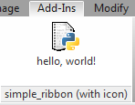

This post explains how to exert more control over the items shown in the RibbonPanel by your RevitPythonShell scripts.

The default behaviour of RevitPythonShell for external scripts is to group them into split buttons  and place the remaining scripts in stacks of up to three. External scripts that are assigned the same “Group” value are placed together in a split button - in the example below, the external scripts “Button five”, “Button six” and “Button seven” are all assigned the group value “Group 5-7”.


After saving your changes, you need to restart Revit to see any changes. The Ribbon will  then include this panel:


This is fine for collecting your personal scripts and while developing new scripts. When it comes to publishing a plugin (even inside your organization) you might want more control of how the buttons appear.

**NOTE**: When you create a [RpsAddin for deployment](http://darenatwork.blogspot.ch/2013/05/deploying-rps-scripts-with.html), you use a slightly different approach by specifying the buttons in the RpsAddin xml file. But you are still limited to PushButtons.

The Revit API contains a selection of controls you can use to execute scripts that you can use instead. You can find out all about these in the [Revit API Developers Guide (Ribbon Panels and Controls)](http://help.autodesk.com/view/RVT/2015/ENU/?guid=GUID-1547E521-59BD-4819-A989-F5A238B9F2B3).

The Revit API expects you to build your Ribbon panels and controls while the application is starting up - during the `IExternalApplication.OnStartup` method of a plugin. After that, the access to the `UIControlledApplication` which is needed to alter the Ribbon is not available anymore. Therefore, you can only access the `UIControlledApplication` object in the RPS [startup script](http://darenatwork.blogspot.ch/2013/05/new-feature-startupscript-in.html) - through a special variable called `__uiControlledApplication__`. The startup script in RPS gives you access to the very variable it uses to configure its own user interface. All we need to do now is hook up an RPS script with a button on the ribbon. Let us assume a very simple script:

```python
"""
helloworld.py - prints a greeting
"""
print 'hello, world!'
```

(you can find this script in the [rps-sample-scripts project](https://github.com/daren-thomas/rps-sample-scripts/blob/master/helloworld.py) on GitHub)

This script shall be called whenever the user clicks a button or other control on our custom Ribbon panel.

There is just one problem here. When you create a control on a Revit Ribbon panel, you need to pass in the path to a DLL and the fully qualified name (including namespaces) of a class inside that DLL that implements `IExternalCommand`. That does not sound like a python script at all!

To support this, the RevitPythonShell exposes a special class called `ExternalCommandAssemblyBuilder` which can create such a DLL. To use it, you just pass in a dictionary of class names and the corresponding python script files. The DLL created is just a very thin wrapper that calls into the `RpsRuntime.dll` (yes, that means you can use this for your RpsAddins!) with the script path and gets them executed.

So, a simple startup script that creates a Ribbon panel with a single `PushButton` would look like this:

```python
'''
simple_ribbon.py - creates a ribbon panel with a single push button.

NOTE:
    - this MUST be set as a startup script for it to work
    - the RPS variable "EXAMPLES_PATH" must be set and contain "helloworld.py"
'''

# script that is run when Revit starts in the IExternalApplication.Startup event.
try:
    import os
    from RevitPythonShell.RpsRuntime import ExternalCommandAssemblyBuilder
    from Autodesk.Revit.UI import *

    SCRIPT_PATH = os.path.join(__vars__['EXAMPLES_PATH'], "helloworld.py")
    DLL_PATH = os.path.expandvars(r"%APPDATA%\RevitPythonShell2015\simple_ribbon.dll")
    print 'storing external command assembly here:', DLL_PATH

    builder = ExternalCommandAssemblyBuilder()
    builder.BuildExternalCommandAssembly(
        DLL_PATH,
        {'HelloWorld': SCRIPT_PATH})

    panel = __uiControlledApplication__.CreateRibbonPanel('simple_ribbon')

    pbd = PushButtonData('pb_HelloWorld', 'hello, world!', DLL_PATH, 'HelloWorld')
    panel.AddItem(pbd)

    #__window__.Close()  # closes the window
except:
    import traceback       # note: add a python27 library to your search path first!
    traceback.print_exc()  # helps you debug when things go wrong
```

(NOTE: you can find this script in the [rps-sample-scripts repository](https://github.com/daren-thomas/rps-sample-scripts/blob/master/StartupScripts/simple_ribbon.py) on GitHub)

The script (and all following scripts in this post) assumes you have the directory structure of the rps-sample-scripts repository downloaded to your machine - a simple git clone should do the trick - and have set the RPS variable `EXAMPLES_PATH` to point to that folder. You could also just edit the script text to hard code the paths and live with the nasty code smell...

Adding `simple_ribbon.py` as your startup script will result in a new ribbon panel added to RPS: 


When clicked, you will be greeted as expected.

There are a few things going on here, so let’s go through them one by one. First, the whole body of the script is wrapped in a try/except. This is important, since a crash in the script might bring down the whole of Revit and you will not know where it happened - so we use `traceback.print_exc()` to print an exception trace. This is a handy debugging tip for your RPS scripting skill set!

Next, we create an assembly for Revit to load when you click the push button. The arguments to `builder.BuildExternalCommandAssembly` include the path of the assembly to be created. I chose to place it in the same folder as the `CommandLoaderAssembly.dll` - which is a similar dll created by RPS for the external scripts defined in the Configure dialog. You can place it anywhere the script has write access to.

Adding a panel to the ribbon and adding a push button to the panel is basically just an exercise of translating the sample c# code from the SDK into python. Adding images is also possible. Consider the following revised version:

% simple_ribbon_with_icons.py (includes images)

This produces a Ribbon panel that looks like this:



As far as I can tell, you only really need to set the `LargeImage` property of the `PushButtonData` object - the `Image` property seems to be an atavism from an ancient version of Revit...

The [rps-sample-scripts repository on GitHub](https://github.com/daren-thomas/rps-sample-scripts/blob/master/StartupScripts/new_ribbon_panel.py) contains a translation of the [New Ribbon Panel example from the Revit API Developer’s Guide](http://help.autodesk.com/view/RVT/2015/ENU/?guid=GUID-1547E521-59BD-4819-A989-F5A238B9F2B3):

```python
"""
new_ribbon_panel.py - a startup script to create a selection of
controls on the ribbon.

This script is based on the New Ribbon Panel and Controls example in the
Revit API Devolopers Guide.

NOTE:
    - this MUST be set as a startup script for it to work
    - the RPS variable "EXAMPLES_PATH" must be set and contain "helloworld.py"
"""

import os
import clr
clr.AddReference('PresentationCore')
from System.Windows.Media.Imaging import BitmapImage
from System import Uri
from RevitPythonShell.RpsRuntime import ExternalCommandAssemblyBuilder
from Autodesk.Revit.UI import *

SCRIPT_PATH = os.path.join(__vars__['EXAMPLES_PATH'], "helloworld.py")
LARGE_IMG_PATH = os.path.join(__vars__['EXAMPLES_PATH'], "PythonScript32x32.png")
SMALL_IMG_PATH = os.path.join(__vars__['EXAMPLES_PATH'], "PythonScript16x16.png")
EXAMPLES_PATH = __vars__['EXAMPLES_PATH']
DLL_PATH = os.path.expandvars(r"%APPDATA%\RevitPythonShell2015\simple_ribbon.dll")
print 'storing external command assembly here:', DLL_PATH


def create_ribbon_panel():
    panel = __uiControlledApplication__.CreateRibbonPanel("New Ribbon Panel")
    add_radio_group(panel)
    panel.AddSeparator()
    add_push_button(panel)
    panel.AddSeparator()
    add_split_button(panel)
    panel.AddSeparator()
    add_stacked_buttons(panel)
    panel.AddSeparator()
    add_slide_out(panel)


def add_radio_group(panel):
    """add radio button group"""
    radio_data = RadioButtonGroupData("radioGroup")
    radio_button_group = panel.AddItem(radio_data)

    tb1 = ToggleButtonData("toggleButton1", "Red")
    tb1.ToolTip = "Red Option"
    tb1.LargeImage = BitmapImage(Uri(os.path.join(
        EXAMPLES_PATH, 'StartupScripts', 'red.png')))

    tb2 = ToggleButtonData("toggleButton2", "Green")
    tb2.ToolTip = "Green Option"
    tb2.LargeImage = BitmapImage(Uri(os.path.join(
        EXAMPLES_PATH, 'StartupScripts', 'green.png')))

    tb3 = ToggleButtonData("toggleButton3", "Blue")
    tb3.ToolTip = "Blue Option"
    tb3.LargeImage = BitmapImage(Uri(os.path.join(
        EXAMPLES_PATH, 'StartupScripts', 'blue.png')))

    radio_button_group.AddItem(tb1)
    radio_button_group.AddItem(tb2)
    radio_button_group.AddItem(tb3)


def add_push_button(panel):
    """add push button"""
    push_button = panel.AddItem(
        PushButtonData("pb_HelloWorld", "Hello, world!",
                       DLL_PATH, "HelloWorld"))
    push_button.ToolTip = "Say hello world"
    context_help = ContextualHelp(ContextualHelpType.Url, "http://www.autodesk.com")
    push_button.SetContextualHelp(context_help)

    push_button.LargeImage = BitmapImage(Uri(LARGE_IMG_PATH))


def add_split_button(panel):
    """add a split button"""
    button_one = PushButtonData("pbButtonOne", "Option one",
                                DLL_PATH, "HelloWorld")
    button_one.LargeImage = BitmapImage(Uri(os.path.join(
        EXAMPLES_PATH, 'StartupScripts', 'one.png')))

    button_two = PushButtonData("pbButtonTwo", "Option two",
                                DLL_PATH, "HelloWorld")
    button_two.LargeImage = BitmapImage(Uri(os.path.join(
        EXAMPLES_PATH, 'StartupScripts', 'two.png')))

    button_three = PushButtonData("pbButtonThree", "Option three",
                                DLL_PATH, "HelloWorld")
    button_three.LargeImage = BitmapImage(Uri(os.path.join(
        EXAMPLES_PATH, 'StartupScripts', 'three.png')))

    split_button = panel.AddItem(SplitButtonData("splitButton", "Split"))
    split_button.AddPushButton(button_one)
    split_button.AddPushButton(button_two)
    split_button.AddPushButton(button_three)


def add_stacked_buttons(panel):
    """Add a text box and combo box as stacked items"""
    combo_box_data = ComboBoxData("comboBox")
    text_data = TextBoxData("Text Box")
    text_data.Image = BitmapImage(Uri(SMALL_IMG_PATH))
    text_data.Name = "Text Box"
    text_data.ToolTip = "Enter some text here"
    text_data.LongDescription = """This is text that will appear next to the image
        when the user hovers the mouse over the control"""
    text_data.ToolTipImage = BitmapImage(Uri(LARGE_IMG_PATH))

    stacked_items = panel.AddStackedItems(text_data, combo_box_data)

    text_box = stacked_items[0]
    text_box.PromptText = "Enter a comment"
    text_box.ShowImageAsButton = True
    text_box.ToolTip = "Enter some text"
    text_box.EnterPressed += lambda sender, args: TaskDialog.Show('new_ribbon_panel', sender.Value)

    combo_box = stacked_items[1]
    combo_box.ItemText = "ComboBox"
    combo_box.ToolTip = "Select an Option"
    combo_box.LongDescription = "Select a number or letter"

    member_data_a = ComboBoxMemberData('A', 'Option A')
    member_data_a.Image = BitmapImage(Uri(os.path.join(
        EXAMPLES_PATH, 'StartupScripts', 'a.png')))
    member_data_a.GroupName = 'Letters'
    combo_box.AddItem(member_data_a)

    member_data_b = ComboBoxMemberData('B', 'Option B')
    member_data_b.Image = BitmapImage(Uri(os.path.join(
        EXAMPLES_PATH, 'StartupScripts', 'b.png')))
    member_data_b.GroupName = 'Letters'
    combo_box.AddItem(member_data_b)

    member_data_c = ComboBoxMemberData('C', 'Option C')
    member_data_c.Image = BitmapImage(Uri(os.path.join(
        EXAMPLES_PATH, 'StartupScripts', 'c.png')))
    member_data_c.GroupName = 'Letters'
    combo_box.AddItem(member_data_c)

    member_data_1 = ComboBoxMemberData('1', 'Option 1')
    member_data_1.Image = BitmapImage(Uri(os.path.join(
        EXAMPLES_PATH, 'StartupScripts', 'one_small.png')))
    member_data_1.GroupName = 'Numbers'
    combo_box.AddItem(member_data_1)

    member_data_2 = ComboBoxMemberData('2', 'Option 2')
    member_data_2.Image = BitmapImage(Uri(os.path.join(
        EXAMPLES_PATH, 'StartupScripts', 'two_small.png')))
    member_data_2.GroupName = 'Numbers'
    combo_box.AddItem(member_data_2)

    member_data_3 = ComboBoxMemberData('3', 'Option 3')
    member_data_3.Image = BitmapImage(Uri(os.path.join(
        EXAMPLES_PATH, 'StartupScripts', 'three_small.png')))
    member_data_3.GroupName = 'Numbers'
    combo_box.AddItem(member_data_3)

def add_slide_out(panel):
    pass  # left as exercise for the reader :)


if __name__ == '__main__':
    try:
        builder = ExternalCommandAssemblyBuilder()
        builder.BuildExternalCommandAssembly(
            DLL_PATH,
            {'HelloWorld': SCRIPT_PATH})
        create_ribbon_panel()
    except:
        import traceback
        traceback.print_exc()
```

If you are really interested on what is produced by the `ExternalCommandAssemblyBuilder`, just use [JetBrains dotPeek](https://www.jetbrains.com/decompiler/) to decompile the `simple_ribbon.dll`. When I tried, I ended up with this:


I'll leave it as an exercise to the reader to get on GitHub and [check out the source for `RpsExternalCommandScriptBase`](https://github.com/architecture-building-systems/revitpythonshell/blob/master/RpsRuntime/RpsExternalCommandBase.cs) - it has a constructor that saves the script path as a member to be called when Revit decides to `Execute` it.
