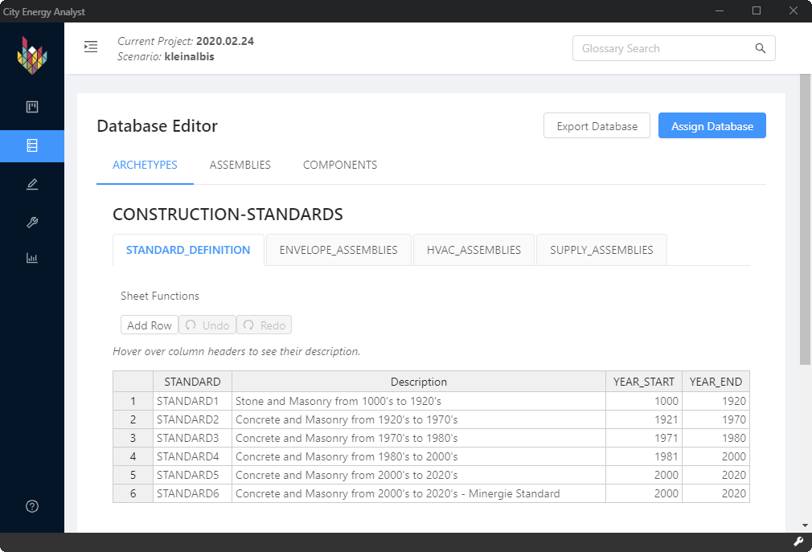

Version 2.30.0 of the City Energy Analyst (CEA) introduced a new feature: The Database Editor.

There's a lot going on here and it will take some time to explain it all.

## tl;dr

The Database Editor allows you to edit region-specific data about your scenario.

One of the problems of building simulation is the vast amount of variables that need to be set. The CEA solves this by providing _archetypes_. An archetype is a template for building properties and schedules.

When you create a new scenario, you're asked to specify the Database to use. This should normally be either "CH" (for Swiss standards) or "SG" (for Singaporean standards), but you _do_ have the option to "Create your own database later" or "Browse for databases path". These last two options play together with the new Database Editor functionality and by the end of this article you should understand how.

