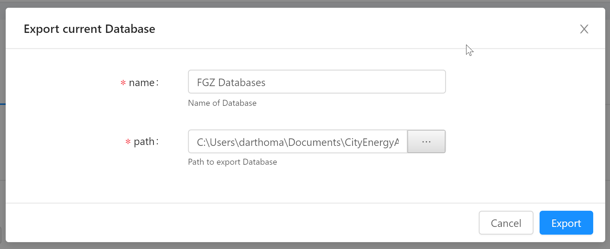
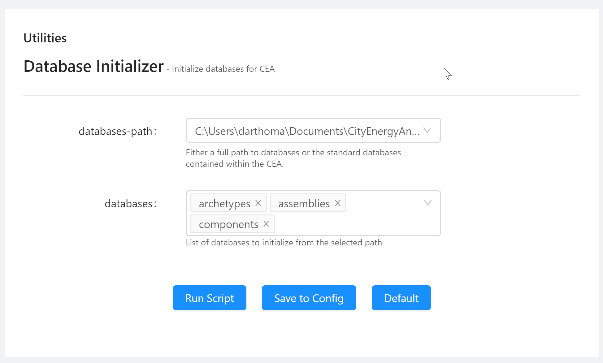

It's time to wrap up the series on working with CEA Databases - in this post we'll examine the role of Components for the CEA simulations as well as assigning and exporting databases for your scenarios.

<!--more-->

This is part 3 in our little series on working with CEA Databases - see [part 1](/cea-databases-part-1) for information on Archetypes and [part 2](/cea-databases-part-2) for information on Assemblies.

## Components

By now we've covered Archetypes and Assemblies. To recap: Archetypes group collections of Assemblies. Archetypes are first set in the typology input table and the Assemblies get mapped to the other input tables using the Archetypes Mapper Tool. Assemblies group core physical properties of various systems under meaningful names. Archetypes and Assemblies are both used in the input tables of the Input Editor.

The last section of the Database Editor is concerned with Components. Components describe Feedstocks, Conversion and Distribution of energy in our models.

You might have noticed that the Supply Assemblies (HEATING, HOT_WATER, COOLING and ELECTRICITY) reference the FEEDSTOCK Components. These Components are used in all the scripts, starting from the Life Cycle scripts all the way to the Optimization scripts.

The other components are used by the CEA scripts, but are not currently linked directly to the assemblies: CONVERSION components are used by all the scripts from Energy Potentials to Optimization. The DISTRIBUTION components are used Networks and Optimization scripts and describe thermal grid properties. A future version of the CEA will clean up the connection between Supply Assemblies and the Components.  

## Exporting Databases

The CEA comes with two default databases - one for Switzerland (CH) and one for Singapore (SG). You can use the Database Editor to customize your database to your specific region - either by implementing the code of your region or adding specific Assemblies tailored to the site you're working on.

Let's say you're conducting analysis for a larger building cooperative - e.g. [FGZ Zürich](https://fgzzh.ch/) - the "kleinalbis" scenario we created in [part 1 of this series](/cea-databases-part-1) is part of the FGZ.

Many buildings will share common construction types and systems. You'll also have much more detailed information at hand than generic regional codes, so it makes sense to spend some time configuring the database. You'll also want to re-use this work for multiple scenarios.

The Database Editor can export the database to a separate folder - outside of your scenario. Use the "Export Database" button in the top-right of the Database Editor.

Enter a path (e.g. the project root of your scenarios) and a name for the database and click "Export". This will create a new folder (e.g. "FGZ Databases") that contains your customizations.

## Assigning Databases

When you create a new scenario, you're asked to provide the database in the "Create New Scenario" dialog. The dropdown lists "CH", "SG" and an option to browse for the database path. Just select the folder you created when exporting your database and the new scenario will be set up with your customized database.

You can also assign databases in an existing scenario using the Database Editor - next to the "Export Database" you'll see a button called "Assign Database". This will bring up the Database Initializer Tool:

Using this tool, you can revert back to the standard database or select a previously exported database. This tool also provides more fine-grained control over which parts of the database to assign: Archetypes, Assemblies and Components can be assigned separately, but note that due to the way they reference each other, you'll need to be careful to maintain data integrity.

