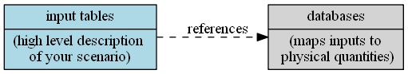
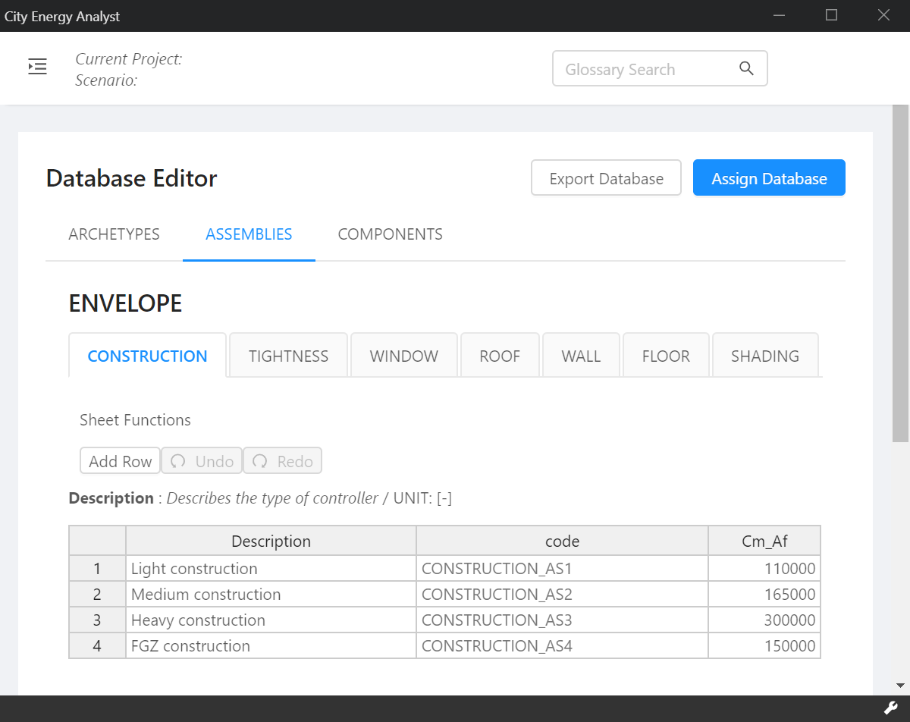

## Configuring your scenario with Assmeblies

The input tables reference the database to provide detailed information about the physical properties of your buildings.

Check the _architecture_ tab in the Input Editor. The fields `type_cons`, `type_leak`, `type_roof`, `type_shade`, `type_wall`, `type_floor`, `type_base` and `type_win` refer to _assemblies_ defined in the database. Hovering over the column header will show you a description of the field.

Click on the `type_cons` entry for the building "B1000" - you can choose from a list of construction assemblies. The Archetype Mapper auto-assigned these based on the construction year, but you can change these values to reflect your scenario.

Let's assume none of the provided construction assemblies match your building. We'll need to create our own construction assembly. Head over to the Database Editor. From the Assemblies menu, choose "Envelope". You can now edit the assemblies for construction, tightness, windows, roofs, walls, floors and shading systems.

The construction assembly defines the following fields: `Description`, `code`, `Cm_Af`. Hover over the `Cm_Af` column header to see the description of this field: 

> **Cm_Af** : Internal heat capacity per unit of air conditioned area. Defined according to ISO 13790. / UNIT: \[J/Km2]

Click the "Add Row" button to add a new construction assembly and fill some information:

You can now use this construction assembly with your scenario in the input editor.
