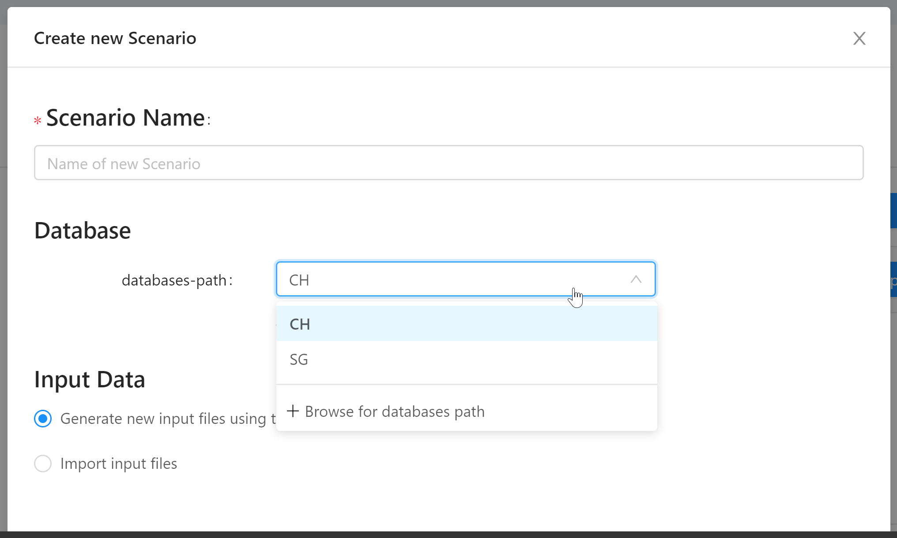

Version 2.30.0 of the City Energy Analyst (CEA) introduced a new feature: The Database Editor. In this 3 part series, I'll explain how to

- jump-start your scenario with Archetypes (this post)
- fine-tune your scenario with Assemblies ([part 2 of this series](/cea-databases-part-2))
- a few words on Components, also exporting and assigning databases ([part 3 in this series](/cea-databases-part-3))

<!--more-->

There's a lot going on here and it will take some time to explain it all.

## tl;dr

The Database Editor allows you to edit region-specific data about your scenario.

One of the problems of building simulation is the vast amount of variables that need to be set. The CEA solves this by providing _Archetypes_. An Archetype is a template for building properties and schedules.

When you create a new scenario, you're asked to specify the Database to use. This should normally be either "CH" (for Swiss standards) or "SG" (for Singaporean standards), but you have the option tof "Browse for databases path". These last two options play together with the new Database Editor functionality and by the end of this post you should understand how.

## Creating a new scenario with a standard Database (CH)

Let's start by creating a scenario with the standard workflow:

1. in the Project Overview, click "Create Project" and enter a name (e.g. "working-with-databases")
2. click "Create New Scenario"
3. name the scenario "kleinalbis"
4. choose the "CH" database for Switzerland
5. select "Generate new input files using tools"
6. select all the Data Management tools (select them in sequence, as their availability is dependant on previous selections)
7. click the settings button for the Weather tool and choose "Zuerich_Kloten_1990_2010_TMY"
8. enter "kleinalbis" in the location search bar and click "Go"
9. use the "Draw" tool on the map to select some buildings (e.g. Kleinalbis 79-83)
10. click "Create" and wait a bit while the CEA does it's magic and routes you to the Input Editor

This will create the basic input files for your scenario: _zone_, _typology_ and _surroundings_.

The [zone input file](https://city-energy-analyst.readthedocs.io/en/latest/input_methods.html#get-zone-geometry) is a [shapefile](https://en.wikipedia.org/wiki/Shapefile). It contains the polygons representing the buildings on the map and defines building names and building heights.

The [surroundings input file](https://city-energy-analyst.readthedocs.io/en/latest/input_methods.html#get-surroundings-geometry) describes building geometries that are not part of the scenario itself, but might cast shadows on the zone buildings.

The [typology input file](https://city-energy-analyst.readthedocs.io/en/latest/input_methods.html#get_building_typology) links the building to a construction standard, a construction year and a 1st, 2nd and 3rd "use". This information is pre-populated from the [OSM](https://en.wikipedia.org/wiki/OpenStreetMap) data in a best-effort manner. This data is used to "guess" the physical properties of the buildings in your scenario. And this is exactly where the databases come in.

## The Archetypes Mapper and the remaining input tables

You might have noticed that the other tables in the Input Editor (_architecture_, _internal-loads_, _indoor-comfort_, _air-conditioning-systems_, _supply-systems_ and _schedules_) are empty. Instead, you're directed to use the "Archetype Mapper" tool. Click on the link and run the tool for all the input databases. This will produce the remaining input tables.

As you can see in the diagram above, we're already using the databases. The Archetypes Mapper uses information stored in the databases to produce the remaining input files.

If you check the Database Editor, you'll see it's divided into three main categories:

1. Archetypes
2. Assemblies
3. Components

The Archetypes Mapper uses the information stored in the Archetypes category: Construction-Standards and Use-Types. It works like this:

The "STANDARD" field in the _typology_ input table is used to look up construction standards in the database (`inputs/technology/archetypes/CONSTRUCTION_STANDARD.xlsx`). The section "ENVELOPE_ASSEMBLIES" is used to create the _architecture_ input table. "HVAC_ASSEMBLIES" and "SUPPLY_ASSEMBLIES" are used for _air-conditioning-systems_ and _supply-systems_ respectively.

The remaining fields ("1ST_USE", "2ND_USE", "3RD_USE") in the _typology_ input table are used to create a weighted average of the occupancy type information in the database. The fields "1ST_USE_R", "2ND_USE_R", "3RD_USE_R" give the respective ratios of that occupancy type in the building. This is used to produce the _internal-loads_, _indoor-comfort_ and _schedules_ tables.

You can run the Archetypes Mapper multiple times and also selectively overwrite only a part of the input tables - each time, the tables are overwritten with the information taken from the Databases. Try changing the STANDARD values as well as setting the occupancy uses in the _typology_ input table for some of your buildings and run the Archetypes Mapper again.

The Archetypes Mapper helps you get your scenario up and running with minimal input. Often, you'll have more information about your buildings and you'll want to manually edit the information in the input tables. This is done by selecting the appropriate Assembly in the input table and is discussed in [part 2 of this series](/cea-databases-part-2).
