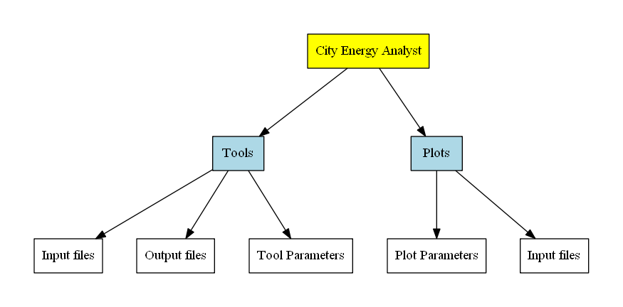
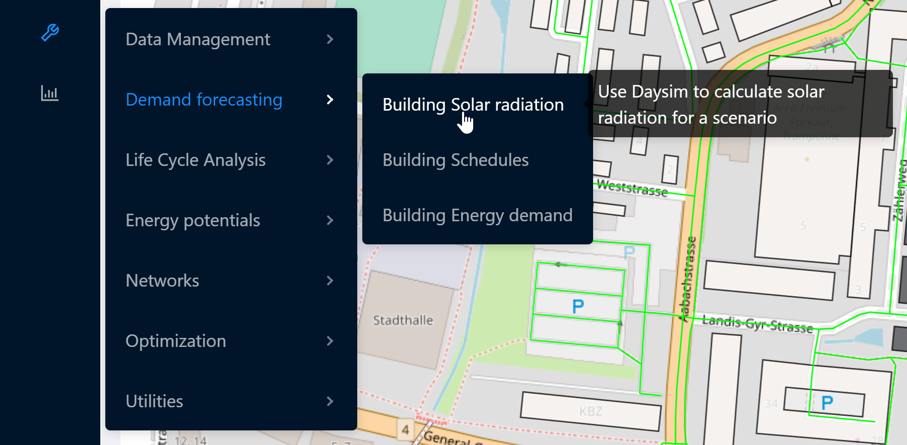
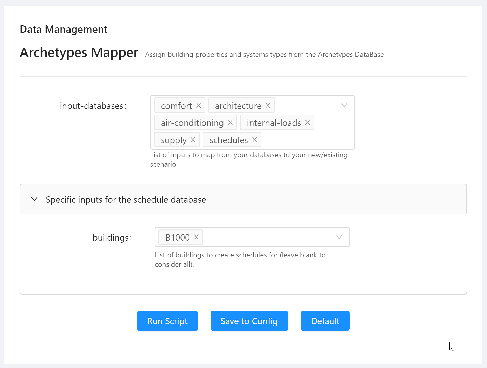
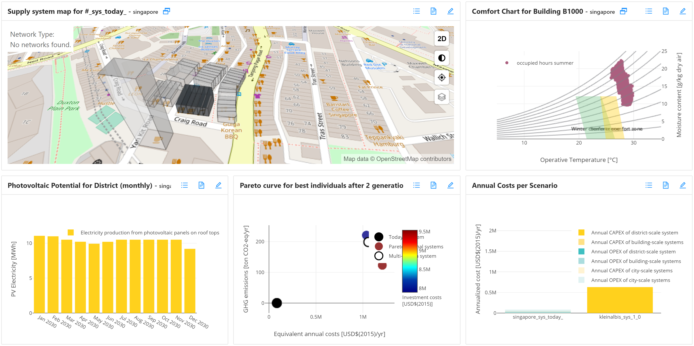
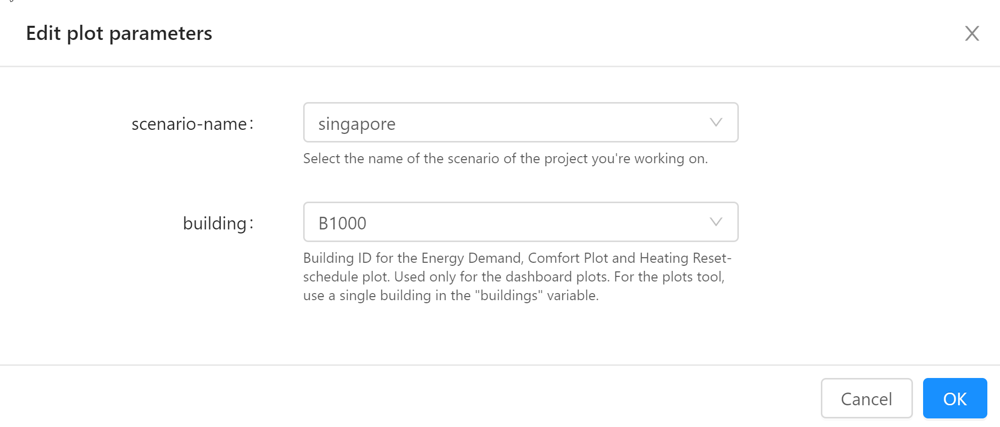

The City Energy Analyst (CEA) consists of a core set of tools and visualizations of the output of those tools. This article is about extending that set with your own tools and your own visualizations. To do that, you'll need to write a CEA plugin.

This blog series will show you just how to do that. I'll be covering the following topics:

- Part 1: Introduction to core CEA concepts and how CEA plugins fit in (this article)

- [Part 2: Anatomy of a CEA plugin](2020-05-25-cea-plugins-part-2)

- Part 2: Introduction to the CEA plugin template

- [Part 3: Introduction to the CEA plugin template](2020-05-25-cea-plugins-part-3)

- [Part 4: How to add your own tools to the CEA](2020-05-25-cea-plugins-part-4)

- [Part 5: How to add your own plots to the CEA](2020-05-25-cea-plugins-part-5)
- [Part 6: Publish your plugin and claim your T-Shirt](2020-05-25-cea-plugins-part-6)

<!--more-->

## Introduction to core CEA concepts

In this chapter, I'll present some of the core CEA concepts. This will help you understand how CEA plugins fit into the ecosystem. If you already understand the CEA Core, you can skip this part and proceed to "Anatomy of a CEA plugin".

The CEA is, at it's core, a collection of tools (sometimes called "scripts") and plots. The two official interfaces to the CEA are the GUI (Graphical User Interface) and the CLI (Command Line Interface).



Each tool reads in input files and produces output files, based on the parameters passed to the tool - e.g. the scenario to work on, what type of network to simulate, which buildings to consider etc. 

Similarly, each plot displays data based on input files, and can be configured with parameters - e.g. which buildings to plot.

## Tools

The CEA organizes the tools by category. In the CEA GUI, the tools can be accessed through the tools menu. In the example below, the user is about to open the "Building Solar radiation" tool in the "Demand forecasting" category.



Each tool has an internal name, different from the label you see in the screenshot. When using the CLI, the internal name is used instead. You can find a list of installed CEA tools by typing the following into the CEA Console:

```bash
λ cea --help
usage: cea SCRIPT [OPTIONS]
       to run a specific script
usage: cea --help SCRIPT
       to get additional help specific to a script

SCRIPT can be one of:
[Data Management]:  archetypes-mapper, streets-helper,
    surroundings-helper, terrain-helper, weather-helper
[Demand forecasting]:  demand, radiation, schedule-maker
[Energy potentials]:  photovoltaic, photovoltaic-thermal,
    sewage-potential, shallow-geothermal-potential, solar-collector,
    water-body-potential
[Life Cycle Analysis]:  emissions, system-costs
[Networks]:  network-layout, thermal-network
[Optimization]:  decentralized, optimization,
    thermal-network-optimization
[Utilities]:  create-mixed-use-type, create-new-scenario,
    data-initializer, database-migrator, dbf-to-excel-to-dbf,
    rename-building, run-all-plots, run-unit-tests, test
[default]:  compile, create-polygon, dashboard, excel-to-shapefile,
    extract-reference-case, list-demand-graphs-fields,
    multi-criteria-analysis, plots, shapefile-to-excel,
    trace-inputlocator, workflow, zone-helper
```

The "Building solar radiation" toolis called `radiation`. It can be run by typing `cea radiation` in the CEA Console. Tools that are composed of multiple words use dashes (`-`) to connect them - e.g. `archetypes-mapper`.

The CEA exposes these tools through a third interface, the `cea.api` Python module. Note that tool names use underscores (`_`) instead of dashes to conform to Python identifier syntax:

```python
# run the Archetypes Mapper tool
import cea.api
cea.api.archetypes_mapper()
```

## Parameters

Each tool can accept a list of parameters - take for instance the Archetypes Mapper tool:



Before running the Archetypes Mapper tool in the GUI, the user has the chance to edit the _parameters_ the tool operates on. For the Archetypes Mapper tool these are:

- `input-databases`

- `buildings` 

When you click "Save to Config", the CEA will remember the values of these parameters and display them the next time you run the tool. This is useful when working from the CEA Console. You can view the parameters of a script in the CEA Console with the `cea-config` command:

```bash
λ cea-config archetypes-mapper
City Energy Analyst version 3.3.0
Configuring `cea archetypes-mapper` with the following parameters:
- general:scenario = C:\reference-case-open\baseline
  (default: {general:project}\{general:scenario-name})
- archetypes-mapper:input-databases = [u'comfort', u'architecture', u'air-conditioning', u'internal-loads', u'supply', u'schedules']
  (default: [u'comfort', u'architecture', u'air-conditioning', u'internal-loads', u'supply', u'schedules'])
- archetypes-mapper:buildings = [u'B1000']
  (default: [])
```

Notice the extra paramater `general-scenario`: This parameter is implicit in the CEA GUI - you are always working in a scenario and is required by most tools.

How does the CEA know which parameters a tool requires? It consults [the `scripts.yml` file](https://github.com/architecture-building-systems/CityEnergyAnalyst/blob/master/cea/scripts.yml). Here's an excerpt of the part relevant to the Archetypes Mapper:

```yaml
Data Management:

  - name: archetypes-mapper
    label: Archetypes Mapper
    description: Assign building properties and systems types from the Archetypes DataBase
    interfaces: [cli, dashboard]
    module: cea.datamanagement.archetypes_mapper
    parameters: ['general:scenario', archetypes-mapper]
    input-files:
      - [get_zone_geometry]
      - [get_building_typology]
```

The parameters for the Archetypes Mapper tool are defined as the list `['general:scenario', archetypes-mapper]` - this refers to the parameter `general:scenario` and all the parameters in the `archetypes-mapper` section of the [Configuration File](https://city-energy-analyst.readthedocs.io/en/latest/the-configuration-file.html). You'll probably want to learn all the [details of the Configuration File ](https://city-energy-analyst.readthedocs.io/en/latest/configuration-file-details.html) when writing your own CEA plugin.

## Input files and Output files

Did you notice the `input-files` list in the definition of the Archetypes Mapper? Each tool can specify a set of files that are checked for existence before the tool is run. The format used is `[locator_method, arg1, arg2, ..., argn]` - the arguments are optional and refer to parameters of the `locator_method`.

So... What is a locator method? It's the name of a method of the `cea.inputlocator.InputLocator` class. Each `InputLocator` instance (by convention, the CEA core uses the variable name `locator` for instances of the `InputLocator`)  is bound to a scenario and the CEA core code uses this object to locate the paths of all files relevant to the CEA.

Each file in the CEA has a "schema" - a description of the properties of this file: It's name, the path to the file (relative to the scenario), the file type (e.g. "csv", "shp", "dbf", etc.) and a description of the data in that file: The column names and types. This is all stored in [the `schemas.yml` file](https://github.com/architecture-building-systems/CityEnergyAnalyst/blob/master/cea/schemas.yml). Your plugin should define a similar file for the additional files it reads and writes. I'll explain how later in this series.

## Plots

The CEA GUI allows you to create dashboards - collections of plots showing the data created by the CEA tools.

Plots are organized by category. Each plot has a name. You can retrieve the full list of available plots by typing `cea-plot` in the CEA Console:

```
λ cea-plot
Usage: cea-plot CATEGORY PLOT-ID [--PARAMETER VALUE]*

Choose from:

comparisons/annualized-costs
comparisons/annualized-emissions
demand/comfort-chart
demand/energy-balance
[...]
thermal-networks/thermal-losses-and-pumping-requirements-per-pipe
thermal-networks/heating-reset-curve
thermal-networks/pumping-duration-curve
```

These are the behind-the-scenes names of the plots - the `cea-plot` tool is useful while developing plots as you can easily plot just a single plot from the CEA Console and have it open up in the browser.

Users of the CEA will typically use the Dashboard to view plots:



The CEA GUI allows arranging plots into a Dashboard view and allows setting plot parameters:



You can read up all about how plots are implemented in the CEA core in [CEA Plots the Gory Details](https://daren-thomas.github.io/cea-plots-the-gory-details/). Luckily, creating plots for CEA plugins is much much simpler. But let's not get ahead of ourselves.

## CEA and Plugins

By now, you should understand the core concepts of the CEA core application. The CEA plugin architecture allows you to extend the CEA functionality by

- adding your own tools

- and adding your own plots

to the CEA.

Your tools and plots can define

- their own input files and output files

- and their own parameters

while also making use of those defined in the CEA. In fact, the system is designed to make this _seamless_: Your tools and plots will show up in the GUI in exactly the same places - with the exception that you'll need to define your own categories to place them in.

Learn more in [Part 2: Anatomy of a CEA plugin](2020-05-25-cea-plugins-part-2).
