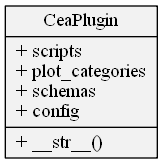

Let's take a bird's-eye view of the parts that make up a CEA plugin. We'll cover the interface expected by the CEA when you define a plugin as well as it's default implementation: `cea.plugin.CeaPlugin`.

If you'd rather just start with an example and tinker from there, skip to [Part 3: Introduction to the CEA plugin template](2020-05-25-cea-plugins-part-3) and come back here if you have any questions.

<!--more-->

This is part 2 in a series of articles on CEA plugins:

- [Part 1: Introduction to core CEA concepts](/2020-05-25-cea-plugins-part-1)

- Part 2: Anatomy of a CEA plugin (this article)

- [Part 3: Introduction to the CEA plugin template](/2020-05-25-cea-plugins-part-3)

- [Part 4: How to add your own tools to the CEA](/2020-05-25-cea-plugins-part-4)

- [Part 5: How to add your own plots to the CEA](/2020-05-25-cea-plugins-part-5)

- [Part 6: Publish your plugin and claim your T-Shirt](/2020-05-25-cea-plugins-part-6)

## Anatomy of a CEA plugin

The CEA maintains a list of plugins in the `config.plugins` list, stored in the Configuration file by fully qualified class name under `general:plugins`. Fully qualified class name means: The whole "path" to the class, including the packages and module. The `cea.config.Configuration` class uses those class names to instantiate plugin objects at runtime.

This leads to a first observation: A CEA plugin is a class that can be instantiated without arguments.



Each plugin is expected to expose the following fields:

- `scripts`: A `dict` containing the definitions of the tools provided by the plugin (in the same shape as `cea/scripts.yml`)
- `plot_categories`: A list of `cea.plots.categories.PlotCategory` instances
- `schemas`: A `dict`containing the definitions of the input and output files added by the plugin (in the same shape as `cea/schemas.yml`)
- `config`: a `configparser.ConfigParser` instance containing the definitions of the parameters provided by the plugin (in the same format as `cea/default.config`)

In addition, the `__str__()` method is expected to return the fully qualified name of the plugin class - this is used to save the list of plugins to the config file. The class `cea.plugin.CeaPlugin` would therefore return `"cea.plugin.CeaPlugin"`

This may sound like a lot to implement, but in practice, creating a CEA plugin is as easy as subclassing `cea.plugin.CeaPlugin` and filling out some files - this is due to the default implementation of these fields as properties of `CeaPlugin`.

## scripts

The default implementation of the `scripts` property will read a `scripts.yml` file in the same folder as the class is defined in and return that.

The `scripts.yml` file is optional. If you don't provide one, then your plugin does not provide any scripts.

See [Part 3: Introduction to the CEA plugin template](2020-05-25-cea-plugins-part-3) for an in-depth look at the contents of such a file - or browse the `cea/scripts.yml` file that defines the [CEA core scripts on GitHub](https://github.com/architecture-building-systems/CityEnergyAnalyst/blob/master/cea/scripts.yml).

## plot_categories

Each plot in the CEA is part of a category - this is represented internally by the `cea.plots.categories.PlotCategory` class and exploses the property `plots` to list all the plot classes in that category. See the [Gory Details](https://daren-thomas.github.io/cea-plots-the-gory-details/) for the full story. You _could_ implement this list yourself, but the default implementation will make your life much, _much_ easier:

The default implementation reads a `plots.yml` file in the same folder as the class is defined in and builds subclasses of `cea.plugin.PluginPlotBase` automatically.

See [Part 5: How to add your own plots to the CEA](2020-05-25-cea-plugins-part-5) for a full explaination of how to write a `plots.yml` file.

The `plots.yml` file is optional. If you don't provide one, then your plugin does not provide any plots

NOTE: If the `plots.yml` mechanism is too simplistic, you can override this property to get the full power of CEA plotting.

## schemas

The default implementation of the `schemas` property will read a `schemas.yml` file in the same folder as the class is defined in an return that.

The format is the exact same format as used by the cea: [`cea/schemas.yml`](https://github.com/architecture-building-systems/CityEnergyAnalyst/blob/master/cea/schemas.yml).

Any locator methods defined in your plugin's `schemas.yml` file will be added as methods to the `cea.inputlocator.InputLocator` class at runtime. In addition, for csv, dbf and shapefiles, the locator method will support `read()` and `write()` to load and save Dataframes to disk. Some examples:

```python
config = cea.config.Configuration()

locator = cea.inputlocator.InputLocator(scenario=config.scenario, plugins=config.plugins)

locator.get_zone_geometry()
Out[4]: u'c:\\project\\scenario\\inputs\\building-geometry\\zone.shp'


zone_df = locator.get_zone_geometry.read()

zone_df.Name
Out[7]: 
0    B1000
1    B1001
2    B1002
3    B1003
4    B1004
5    B1005
Name: Name, dtype: object
```

The path denoted by the locator method definitions is given by the field `file_path`. This is a string using forward slashes (`/`) to separate path names, relative to the current scenario. You can embedd variables in this string using the syntax `{varname}` and the InputLocator will replace those variables with keyword arguments provided when calling either the locator method itself or the `read` and `write` methods.

The `schemas.yml` file is optional. If you don't provide one, then your plugin does not provide any input and output files - this could be the case for a plugin that only provides new plots to data already provided by the CEA core.

## config

The default implementation of the `config` property will read a `plugin.config` file in the same folder as the class is defined in and return it as a `configparser.ConfigParser` object.

See [Configuration File Details](https://city-energy-analyst.readthedocs.io/en/latest/configuration-file-details.html) for more information on how to set this up.

The `plugin.config` file is optional. If you don't provide one, then your plugin does not provide any additional parameters to the ones provided by the CEA core.

## Summary

The default implementation of the `cea.plugin.CeaPlugin` class does most of the heavy lifting for you. This leaves you to focus on the content of your plugin: The scripts and plots.

To create your own plugin, you should therefore start with something like this:

```python
import cea.plugin

class MyPlugin(cea.plugin.CeaPlugin):
    pass
```

This is already a valid plugin, although one that doesn't really do much - adding the files mentioned above (`scripts.yml`, `plots.yml`, `schemas.yml` and `plugin.config`) will automatically add functionality to your plugin.

A good starting point is the [CEA plugin template repository on GitHub]([https://github.com/architecture-building-systems/cea-plugin-template](https://github.com/architecture-building-systems/cea-plugin-template)) - read all about that in [Part 3: Introduction to the CEA plugin template](2020-05-25-cea-plugins-part-3)!
