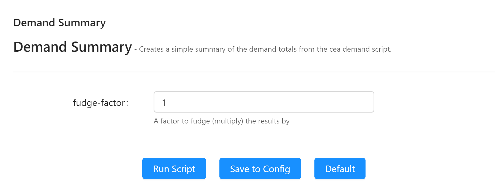

The easiest was to get started creating your own plugin is to start with the CEA plugin template. In this article, we'll get you started with your own plugin based on the [CEA plugin template on GitHub](https://github.com/architecture-building-systems/cea-plugin-template).

<!--more-->

This is part 3 in a series of articles on CEA plugins:

- [Part 1: Introduction to core CEA concepts](/cea-plugins-part-1)

- [Part 2: Anatomy of a CEA plugin](/cea-plugins-part-2) 

- Part 3: Introduction to the CEA plugin template (this article)

- [Part 4: How to add your own tools to the CEA](/cea-plugins-part-4)

- [Part 5: How to add your own plots to the CEA](/cea-plugins-part-5)

- [Part 6: Publish your plugin and claim your T-Shirt](/cea-plugins-part-6)

## Introduction to the CEA plugin template

We've set up a [repository with a sample CEA plugin on GitHub](https://github.com/architecture-building-systems/cea-plugin-template). When installed, it adds a new tool called "Demand Summary" to the CEA:


This tool defines a parameter `fudge-factor`:



It also includes a new plot "Total System Demand":


I realize this is all a bit simplistic. That's on purpose: The template is supposed to give you a starting point for your very own awesome - and not distract you with a ton of code you'll need to go and delete.

## Create a repository based on the CEA plugin template

Head over to the [CEA plugin template repository on GitHub](https://github.com/architecture-building-systems/cea-plugin-template). You'll see a green button above the file list called "Use this template":


When you click this button, GitHub will let you create a new repository based on the files in this template - choose a name for your new plugin:


There. You're up and running! You'll need to figure out how to clone that repository to your local computer and start messing around - I'm sure the [folks at GitHub](https://help.github.com/en/github/creating-cloning-and-archiving-repositories/cloning-a-repository) can explain this better than I ever could.

## CEA plugin template walkthrough

Let's take a look at the files in the template:

```
my-awesome-plugin
│   .gitignore
│   LICENSE
│   README.md
│   setup.py
│
\---cea_plugin_template
        demand_summary.py
        plots.yml
        plugin.config
        schemas.yml
        scripts.yml
        __init__.py
```

Note that you'll want to rename the package`cea_plugin_template` to something more meaningful to your plugin - this will form the first part of the fully qualified name of your plugin. You'll also want to come up with a new name for `demand_summary.py`. And give the rest of the files a quick look too...

In this article, we'll quickly discuss `.gitignore`, `LICENSE`, `README.md` and `setup.py` as well as `_cea_plugin_template`.

The files `scripts.yml`, `demand_summary.py`, `schemas.yml`, and `plugin.config` will be discussed in [Part 4: How to add your own tools to the CEA](/cea-plugins-part-4).

The file `plots.yml` get's it's own article: [Part 5: How to add your own plots to the CEA](/cea-plugins-part-5)

### .gitignore, LICENSE and README.md

These three files are not specific to CEA plugins at all - the `cea-plugin-template` is a GitHub repository and these files have meaning to `git` and GitHub:

- `.gitignore` tells `git` to ignore certain files when commiting code to the repository

- `LICENSE` describes the license of the plugin - `cea-plugin-template` uses the open source [MIT License](https://opensource.org/licenses/MIT), the same license under which the CEA is published. It's a good idea to specify the license of your plugin - especially if you post the code anywhere. Your plugin does not _have_ to be open source - that is up to you.

- `README.md` contains the documentation that is shown when you [visit the repository on GitHub](https://github.com/architecture-building-systems/cea-plugin-template).

### setup.py

The `setup.py` file is used by python to install the plugin and to publish it to the [Python Package Index (PyPI)](https://pypi.org/). The example in the template should be enough to get you up and running. Open it in your editor of choice and replace the contents of all strings to match your project - this includes information about the author, package name etc...

### \_\_init\_\_.py

Python uses this file to mark the folder `cea_plugin_template` as a package. Normally, this file is empty. Remember: You'll be renaming `cea_plugin_template` to a package name more suitable to your plugin.
